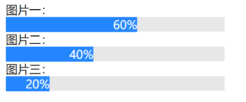

# 用css实现loading效果

> 参考张鑫旭老师的文章《CSS变量对JS交互组件开发带来的提升与改革》

有了CSS变量之后，这种loading效果可以变得十分简洁。js所做的工作就只是在容器元素上设置loading进度值即可，其他什么都不需要做（即代码中的`style="--percent: 60"`），至于样式表现，或者进度值如何显示，全部都是CSS的事情。

 

## 实现效果

